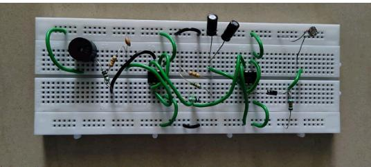

# Fridge-Door-Alarm
# Fridge Door Alarm System

A simple and cost-effective refrigerator door alarm system using two 555 Timer ICs, a Light Dependent Resistor (LDR), and a buzzer. The system alerts the user when the refrigerator door is left open, helping to reduce energy loss and prevent food spoilage.

---

## Abstract

This project presents a simple and effective fridge door alarm system using two 555 Timer ICs, a Light Dependent Resistor (LDR), and a buzzer. The system is designed to alert users when the refrigerator door is left open, preventing energy loss and food spoilage.

The LDR detects the light entering the refrigerator when the door is opened. This change in light intensity triggers the timer circuit, which activates the buzzer after a preset delay. The circuit is compact, cost-effective, and suitable for household applications.

---

## Components Used

- NE555 Timer IC × 2
- Light Dependent Resistor (LDR)
- Buzzer
- Resistors
- Capacitors
- Diode
- DC Power Supply (5V–12V)
- Breadboard / PCB
- Connecting Wires

---
## Circuit Diagram

## Methodology

### Sensor Mechanism
An LDR is placed inside the refrigerator to detect light. When the door is closed, the LDR remains in darkness. When the door is opened, light falls on the LDR, causing its resistance to decrease.

### Signal Processing
The LDR and resistor R1 form a voltage divider. The resulting voltage is applied to the trigger input of the first 555 Timer (U1), configured as a monostable multivibrator.

### Timing Control
U1 generates a single pulse for a fixed duration determined by resistor R2 and capacitor C1.

### Alert System
The output of U1 activates the second 555 Timer (U2), configured as an astable multivibrator. U2 generates pulses that drive the buzzer to produce an intermittent alarm.

### Protection
A diode protects the circuit from reverse polarity, while capacitors improve timing stability and reduce electrical noise.

---

## Working Principle

- The LDR and resistor R1 form a voltage divider.
- When light falls on the LDR, its resistance decreases.
- This voltage change triggers the first 555 Timer (U1).
- U1 produces a HIGH pulse for a preset time.
- The output from U1 enables the second 555 Timer (U2).
- U2 generates pulses that drive the buzzer.
- The buzzer continues to sound until the refrigerator door is closed.

---

---

## Prototype

---

## Advantages

- Low-cost design
- Easy to build
- Low power consumption
- Reliable operation
- Prevents food spoilage
- Saves electrical energy

---

## Applications

- Household refrigerators
- Commercial refrigerators
- Cold storage units
- Medical refrigeration systems

## Author

**Iyappan E**
